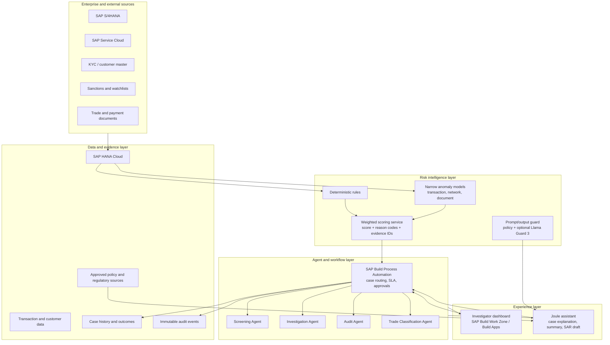
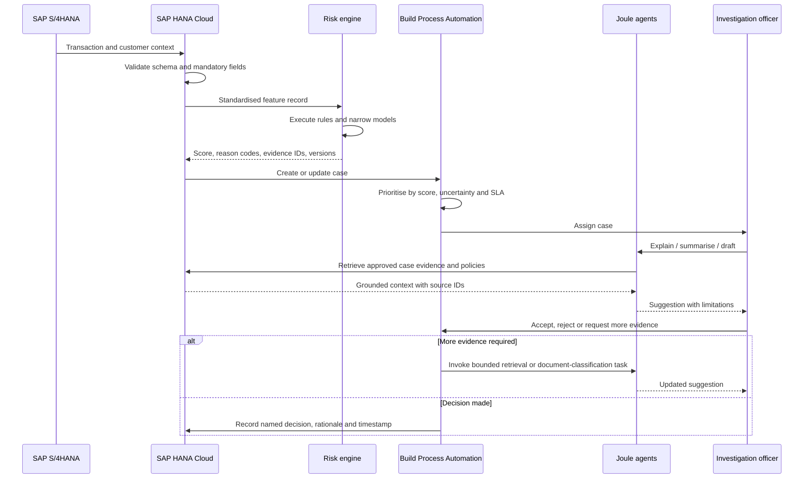

# RiskSignal solution architecture

## Architecture principles

- **Decision support, not autonomous financial-crime decisioning.**
- **Evidence before explanation:** generative output may only use approved case facts and policy sources.
- **Reason codes are the scoring contract:** the model output is not sufficient without a point-by-point breakdown.
- **Uncertainty escalates:** missing mandatory data blocks straight-through processing; ambiguous data is labelled for review.
- **Every action is attributable:** transaction inputs, rules, model versions, prompts, responses, evidence and officer decisions are retained.

## Logical architecture



## Transaction-to-decision workflow



## Risk-score contract

The demo uses an additive score capped at 100:

```text
risk_score = min(100, Σ rule_points + Σ model_signal_points + data_quality_points)
```

Each contribution must include:

```json
{
  "factor_id": "DQ.UBO.MISSING",
  "label": "Ultimate beneficiary identifier missing",
  "points": 20,
  "evidence_ids": ["tx:TX-882190", "field:ultimateBeneficiaryId"],
  "policy_version": "RM-2.4",
  "model_version": null,
  "observed_at": "2026-07-30T14:21:05+08:00"
}
```

Rules and narrow models may change the points only through an approved, versioned policy. The generative assistant cannot change the score.

## Data handling

### HANA Cloud domains

- `transaction`: payment facts and source-system lineage.
- `party`: customer, beneficiary and related-party identities.
- `signal`: rule and model outputs with evidence IDs.
- `case`: state, priority, owner, SLA and disposition.
- `case_event`: append-only human and system actions.
- `policy_source`: approved, effective-dated governance documents.
- `model_registry`: owner, intended use, validation, versions and thresholds.

### Data-quality policy

- **Missing mandatory field:** create a specific data-quality signal, add the approved point contribution and block straight-through release.
- **Ambiguous value:** preserve the original value, attach a confidence score and route to a human if it affects material risk.
- **Unavailable optional field:** do not infer a negative fact. Record that the field was unavailable and continue only if policy permits.

## Agent responsibilities

| Agent | May do | Must not do |
| --- | --- | --- |
| Screening Agent | Retrieve watchlist results, compare identity attributes and cite the screening record | Declare a legal sanctions match without the required review |
| Investigation Agent | Summarise evidence, identify gaps and suggest next steps | Release, block or escalate a case |
| SAR Drafting skill | Draft a narrative from verified facts and jurisdiction templates | File a SAR or invent missing facts |
| Audit Agent | Check required evidence, versions and approvals; prepare an evidence bundle | Change historical records |
| Trade Classification Agent | Suggest commodity or transaction classifications with confidence and sources | Override an officer or customs determination |

## AI guardrails

1. **Input gate:** entitlements, schema, prompt injection and sensitive-data handling.
2. **Retrieval gate:** approved policy sources, effective dates, jurisdiction and source identifiers.
3. **Model gate:** approved version, monitored drift, evaluation threshold and kill switch.
4. **Output gate:** factual grounding, reason-code coverage, prohibited actions and sensitive-data leakage.
5. **Decision gate:** authenticated officer, segregation of duties and recorded rationale.

Llama Guard 3 can contribute to the input/output content-safety gate. It should not be labelled the “AI orchestrator”; SAP Build Process Automation and bank-owned policy services orchestrate the business workflow.

## Production roadmap

### Phase 1 — explainable baseline

- Land transaction and case history in HANA Cloud.
- Reproduce current rules as versioned reason codes.
- Establish data-quality checks and an auditable weighted score.
- Build the investigation queue and named officer approvals.

### Phase 2 — narrow AI

- Curate labelled historical outcomes with leakage and bias checks.
- Train bounded anomaly or classification models for specific patterns.
- Run champion–challenger evaluation against the explainable baseline.
- Introduce signals only after independent validation and threshold approval.

### Phase 3 — agent assistance

- Add Joule explanation, summary and controlled SAR drafting.
- Ground the assistant in case evidence and effective-dated governance sources.
- Add prompt/output evaluation, red-team tests and operational monitoring.

### Phase 4 — scale and assurance

- Integrate Service Cloud handoffs and SAP Analytics Cloud reporting.
- Automate evidence packs and recurring model validation.
- Review false positives, emerging typologies and officer feedback on a governed cadence.

## Non-functional targets

| Area | Initial target |
| --- | --- |
| Scoring latency | p95 under 2 seconds after the transaction record is complete |
| Availability | 99.9% for case creation and officer workflow |
| Auditability | 100% of scores have reason codes and evidence IDs |
| Human accountability | 100% of material dispositions identify an authorised officer |
| Model change control | No unvalidated model or threshold reaches production |
| Data residency | Selected per jurisdiction and bank policy |
| Explainability | The top drivers and total score are reproducible from retained inputs |
