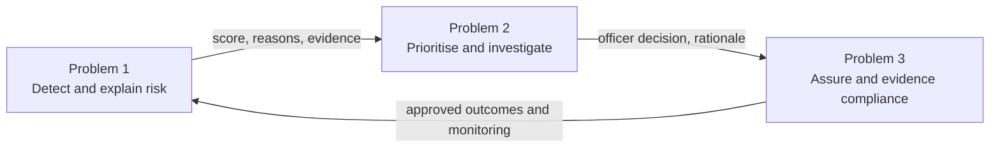
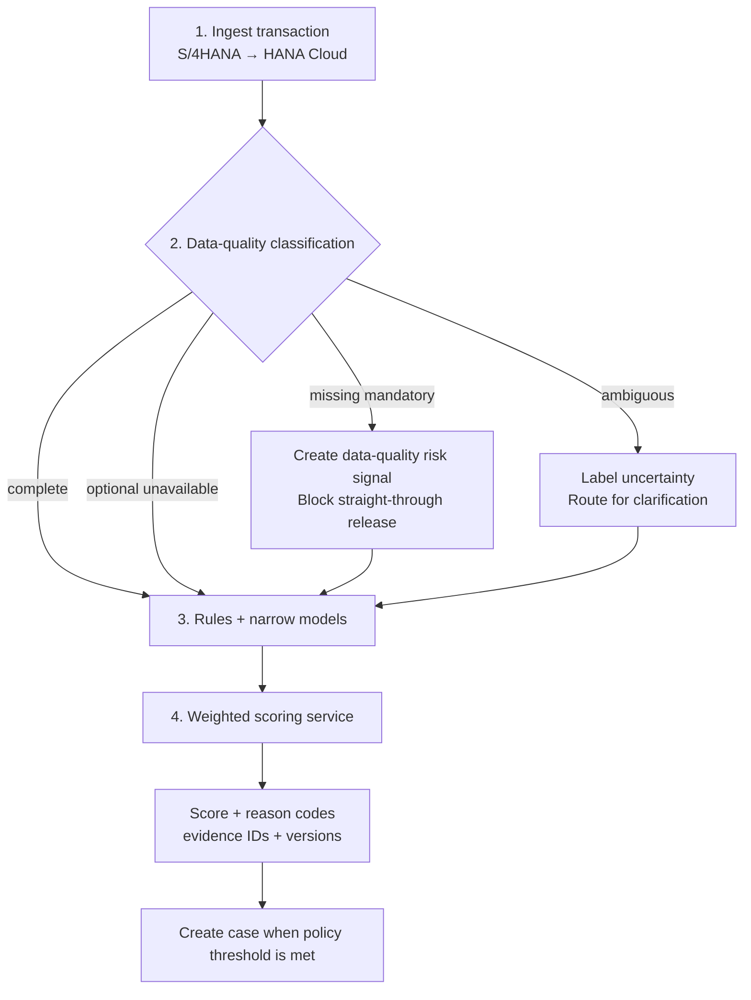
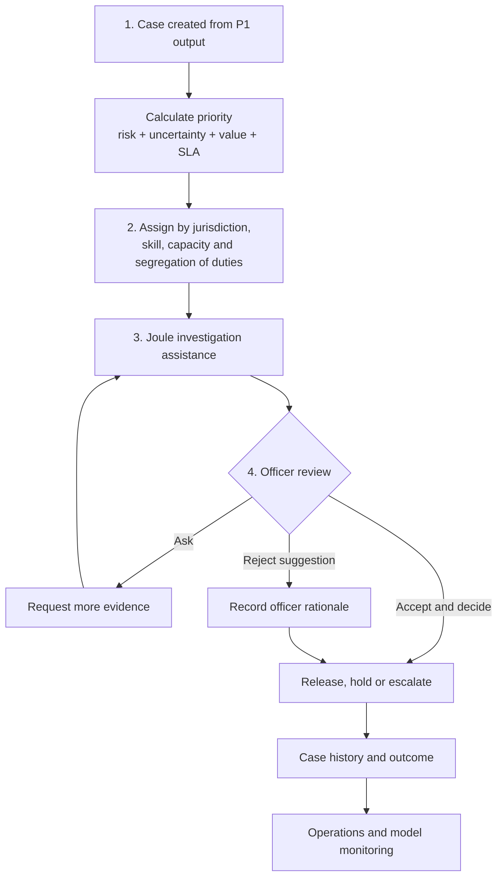
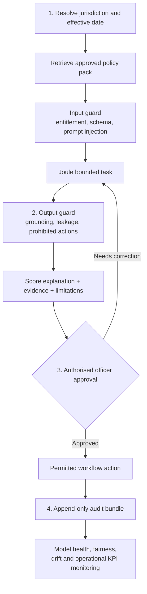

# Integrated workflows for Problems 1, 2 and 3

The three problems are not separate products. They are control layers in one financial-crime operating model:



The workflow creates an unbroken chain from source transaction to model monitoring. Every system action has an owner, an output and a control gate.

## Problem 1 — Outdated risk-management framework

### Objective

Detect complex financial-crime patterns without relying solely on static thresholds, while keeping the score reproducible and understandable.



### Steps

| Step | Owner | System | Action | Output | Control |
| --- | --- | --- | --- | --- | --- |
| P1.1 Ingest | Data pipeline | S/4HANA and HANA Cloud | Join transaction, customer, beneficiary, device and behavioural context | Standardised record with lineage | Schema, entitlement and timestamp validation |
| P1.2 Data quality | Data Quality Agent | HANA Cloud | Classify complete, missing-mandatory, unavailable-optional and ambiguous fields | Explicit quality signals | Ambiguity is not converted into adverse fact |
| P1.3 Detect | Screening Agent | Rules and narrow AI | Execute velocity, routing, profile, network and document models | Versioned signals | Generative AI is excluded from scoring |
| P1.4 Score | Risk engine | Weighted scoring service | Add approved reason-code contributions and cap at 100 | Score and factor breakdown | Every point has evidence and policy lineage |

### Scoring contract

```text
risk_score = min(100, Σ deterministic_rule_points
                      + Σ validated_model_signal_points
                      + Σ approved_data_quality_points)
```

The score response must contain:

- total score and risk band;
- factor ID, label and point contribution;
- evidence IDs;
- rule, policy and model versions;
- observation timestamp;
- uncertainty and missing-data indicators.

### Narrow AI model boundaries

Use separate, bounded models for:

- transaction-velocity anomaly;
- customer-profile deviation;
- counterparty-network anomaly;
- unusual trade-route detection;
- document-category or invoice mismatch.

Each model enters production through inventory registration, independent validation, threshold approval, monitoring and a kill switch. Model signals support a defined point contribution; they do not directly release, reject or report transactions.

## Problem 2 — Operational inefficiency

### Objective

Concentrate investigators on the highest-value work, reduce manual evidence collection and make every disposition attributable.



### Steps

| Step | Owner | System | Action | Output | Control |
| --- | --- | --- | --- | --- | --- |
| P2.1 Prioritise | Workflow orchestrator | SAP Build Process Automation | Rank cases by risk, uncertainty, value and remaining SLA | Prioritised queue | Versioned and reproducible priority policy |
| P2.2 Assign | Case router | Build Process Automation / Service Cloud | Route by jurisdiction, skill, workload and segregation of duties | Named case owner | Conflict and capacity checks |
| P2.3 Assist | Investigation Agent | Joule Studio | Explain, summarise, identify gaps and suggest next steps | Grounded case brief | Approved evidence and policy sources only |
| P2.4 Decide | Investigation officer | SAP Build dashboard | Accept, reject or ask for evidence; select disposition | Named decision and rationale | Human authority required for material action |

### Scaling policy

Priority is recalculated when the case changes:

```text
priority = risk_weight
         + uncertainty_weight
         + exposure_weight
         + sla_urgency_weight
         + typology_priority
```

Assignment considers:

- investigation jurisdiction and language;
- officer certification and specialist skills;
- open workload and current SLA exposure;
- previous involvement and segregation-of-duties conflicts;
- case sensitivity and escalation tier.

### History database

The case history stores:

- every status transition;
- source transaction and evidence references;
- score and policy versions at each material event;
- agent prompts, retrieved source IDs and generated outputs;
- evidence requests and responses;
- officer identity, decision, rationale and overrides;
- SAR draft and approval state;
- verified outcome label for later model validation.

## Problem 3 — Regulatory intensity

### Objective

Demonstrate explainability, human accountability and model-risk discipline for each use of AI in financial-crime decision support.



### Steps

| Step | Owner | System | Action | Output | Control |
| --- | --- | --- | --- | --- | --- |
| P3.1 Jurisdiction | Governance Assistant | Policy knowledge service | Resolve applicable sources by jurisdiction and effective date | Control pack with source identifiers | Approval, checksum and effective-date validation |
| P3.2 Validate output | Output Guard | Policy rules and optional Llama Guard 3 | Check grounding, prohibited actions, sensitive data and limitations | Permitted, corrected or blocked response | Content safety never replaces bank controls |
| P3.3 Draft and approve | SAR Drafting skill and officer | Joule Studio / Build Process Automation | Draft only from verified facts and require named approval | Reviewed draft or evidence request | Dual control and jurisdiction-specific authority |
| P3.4 Audit and learn | Audit Agent / Model Risk | HANA Cloud / Analytics Cloud | Package evidence and monitor verified outcomes | Audit bundle and validation feedback | Append-only log and label-quality review |

### Required evidence bundle

Each material case should be reproducible from:

1. source transaction and data lineage;
2. data-quality classification;
3. rule and model inputs, outputs and versions;
4. score contributions and evidence IDs;
5. effective policy and regulatory source versions;
6. agent prompt, retrieved sources and response;
7. output-guard result;
8. officer identity, action, rationale and timestamp;
9. SAR draft and approval state, if applicable;
10. final outcome and monitoring feedback.

### Human-accountability boundary

| AI may | Authorised human only |
| --- | --- |
| Detect bounded patterns | Release or reject a transaction |
| Calculate a versioned, approved score | Place or remove a legal hold |
| Prioritise a queue | Confirm a sanctions match |
| Explain risk contributions | Escalate to formal investigation |
| Summarise retrieved evidence | Approve or file a SAR |
| Draft a narrative from verified facts | Override policy or model controls |

## End-to-end RACI

| Activity | Data Engineering | Financial Crime Operations | Model Risk | Compliance / Legal | Internal Audit |
| --- | --- | --- | --- | --- | --- |
| Data ingestion and lineage | R | C | C | I | I |
| Rule and feature definition | C | R | A | C | I |
| Model validation and threshold approval | C | C | R/A | C | I |
| Queue and assignment policy | C | R/A | C | I | I |
| Case disposition | I | R/A | I | C | I |
| SAR approval and filing | I | R | I | A | I |
| Policy-source approval | I | C | C | R/A | I |
| Evidence-bundle review | I | C | C | C | R/A |

Legend: **R** responsible, **A** accountable, **C** consulted, **I** informed.

## Demo implementation

The **Workflow Studio** in the application executes 12 controls over synthetic transaction `TX-882190`. It supports:

- Singapore and United States demonstration jurisdiction packs;
- step-by-step progression and direct step inspection;
- owner, system, action, evidence and control display;
- cross-problem hand-offs;
- final risk, priority, human decision and audit-completeness outcome.

This is an interactive control simulation. Production integrations, models, regulator feeds and filing systems require tenant-specific implementation and validation.
